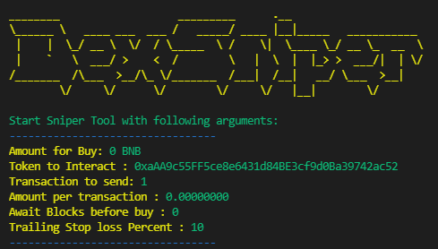
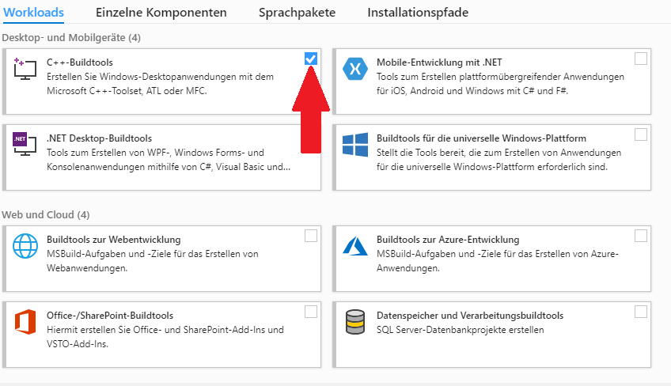

## Bot still working in 02/03/2024

# 🚀 Pancakeswap BSC - Uniswap ERC-20 Sniper Bot 🚀

Pancakeswap BSC - Uniswap ERC-20 Sniper Bot with Telegram Alert Web3

https://etherscan.io/tx/0x6d0ccefbaa2947f3eec6d54ebc7af6b079b379ce2317e2405bdf581f34389591
https://etherscan.io/tx/0x8c18fcba662a99f76f01e0032b6a512175ad643eec8e9f9ed6c7d41a2a43d5ab


**For now, Telegram Alerts are under development.**

## Our thanks:

BOT is free-to-use, but you are welcome to appreciate my work ☺️

ETH - 0xaAA9c55FF5ce8e6431d84BE3cf9d0Ba39742ac52

BNB - 0xaAA9c55FF5ce8e6431d84BE3cf9d0Ba39742ac52

# Features

- HoneyPot checker
- Trailing target profit & Stop loss
- Liquidity sniping
- Minimum taxes check (lot of rugs/scam have 0% taxes)
- Coming soon: ERC-20 support
- Coming soon: Telegram Alerts with custom bot



# Download

### If you are not familiar with GIT please have a look at [Releases]

Clone Repo:

```shell
git clone https://github.com/DexSniping/DexSniping-BSC-ERC20-Telegram-Alerts.git
cd DexSniping-BSC-ERC20-Telegram-Alerts
```

# Install

**I'm using version 3.12.2 of Python, you can download it here (Be sure to use this version at least to avoid problems with the bot)**: [https://www.python.org/downloads/release/python-3122/](https://www.python.org/downloads/release/python-3122/)

Install Requirements:

**Try to add "3" after python if you have problems, like: python3 sniper.py...**

```python
python -m pip install -r requirements.txt
```

### Setup your address (just under your account name) and secret key in Settings.json.


Start Sniper:

```python example
python Sniper.py -t <TOKEN_ADDRESS> -a <AMOUNT> -tx <TXAMOUNT> -hp -wb <BLOCKS WAIT BEFORE BUY> -tp <TAKE PROFIT IN PERCENT> -sl <STOP LOSE IN PERCENT>
python Sniper.py -t 0xaAA9c55FF5ce8e6431d84BE3cf9d0Ba39742ac52 -a 0.1 -tx 2 -hp  -wb 10 -tp 50
python Sniper.py -t 0xaAA9c55FF5ce8e6431d84BE3cf9d0Ba39742ac52 --sellonly
python Sniper.py -t 0xaAA9c55FF5ce8e6431d84BE3cf9d0Ba39742ac52 -a 0.1 --buyonly
python Sniper.py -t 0xaAA9c55FF5ce8e6431d84BE3cf9d0Ba39742ac52 -tsl 10 -nb
```

Here are all options with infos:

```python3
'-t', '--token', help='str, Token for snipe e.g. "-t 0xaAA9c55FF5ce8e6431d84BE3cf9d0Ba39742ac52"'
'-a', '--amount', default=0, help='float, Amount in Bnb to snipe e.g. "-a 0.1"'
'-tx', '--txamount', default=1, help='int, how mutch tx you want to send? It Split your BNB Amount in e.g. "-tx 5"'
'-sp', '--sellpercent', default=100, help='int, how mutch tokens you want to sell? Percentage e.g. "-sp 80"'
'-hp', '--honeypot', default=False, help='Check if your token to buy is a Honeypot, e.g. "-hp" or "--honeypot"'
'-nb', '--nobuy', help='No Buy, Skipp buy, if you want to use only TakeProfit/StopLoss/TrailingStopLoss'
'-tp', '--takeprofit', default=0, help='int, Percentage TakeProfit from your input BNB amount "-tp 50" '
'-sl', '--stoploss', default=0, help='int, Percentage Stop loss from your input BNB amount "-sl 50" '
'-tsl', '--trailingstoploss', default=0, help='int, Percentage Trailing-Stop-loss from your first Quote "-tsl 50" '
'-wb', '--awaitBlocks', default=0, help='int, Await Blocks before sending BUY Transaction "-wb 5" '
'-cmt', '--checkMaxTax', help='get Token Tax and check if its higher.'
'-cc', '--checkcontract', help='Check is Contract Verified and Look for some Functions.'
'-so', '--sellonly', help='Sell all your Tokens from given address'
'-bo', '--buyonly', help='Buy Tokens with from your given amount'
'-cl', '--checkliquidity', help='with this arg you use liquidityCheck'
'-r', '--retry', default=3, help='with this arg you retry automatically if your tx failed, e.g. "-r 5" or "--retry 5" for max 5 Retrys'
'-sec', '--SwapEnabledCheck', help='this argument disabled the SwapEnabled Check!'
```

Run on Android you need Install [Termux](https://termux.com/)

```shell
termux: $ pkg install python git
Debian/Ubuntu: $ sudo apt install python3 git make gcc
Windows: Need to install Visual Studio BuildTools & Python3
```

**For Windows:**
Download Windows BuildTools: https://visualstudio.microsoft.com/visual-cpp-build-tools/

And install **BuildTools C++**



## Trailing-Stop-Loss:


## Troubleshooting:

<em>Problem: My bot does not start and displays a "loadTokens" or "unknown opcode" error:</em>

Solution: I'm using version 3.12.2 of Python, you can download it here (Be sure to use this version at least to avoid problems with the bot): [https://www.python.org/downloads/release/python-3122/](https://www.python.org/downloads/release/python-3122/)

<em>Problem: "python" does not work, what to do?</em>

Solution: Try to add "3" after python if you have problems, like: python3 sniper.py...

<em>Problem: I have a problem when I try to install the requirements</em>

Solution: Be sure to download and install **BuildTools C++** https://visualstudio.microsoft.com/visual-cpp-build-tools/
